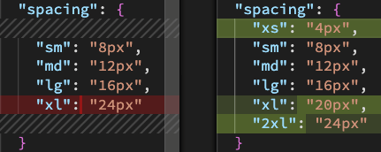
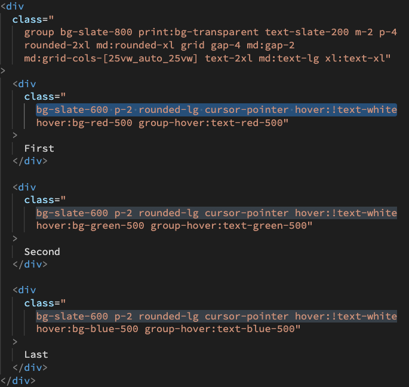

# An skeptical's dive into tailwind

## Preface

A few months ago I started working in a project that uses TailwindCSS for styling. When I first found about this I though _"why? what's this? why should I care?"_. At first I really didn't like it, and I still don't love it, but I came to understand the benefits and I thought I'd share my thoughts on them.

_Disclaimer:_ I only have a few months of experience working with Tailwind and I may have incomplete or erroneous notions, so take this post with a grain of salt.

## What is Tailwind

> _"A utility-first CSS framework packed with classes."_ > https://tailwindcss.com/

What does this mean? Tailwind comes out of the box with a predefined set of reusable classes, that can be configured and/or extended. In practice it's usually similar to writing inline CSS, for better or worse, except with less typing. You can still use these utility classes from CSS rather than the HTML, but it's not the common practice with the framework.

## Why use Tailwind

Speed. You could very easily recreate the prebuilt styles that come with Tailwind with SASS or LESS, even replicating the configurability and extensibility if you wanted to. But Tailwind exists so you don't have to. These prebuilt classes are also usually quite brief, so you don't need to type much to make use of them.

- For instance, if you wanted to apply a padding top of 1rem you would simply need to type `pt-8`.
  (Note that Tailwind's sizes don't really reflect the value applied).

## Pros and cons

### Pros

- Prebuilt classes, with short names that facilitate typing them.
- Prebuilt modifiers.
  - You can target specific device ranges, print mode, generic states (hover, focus, and active), input states (required, invalid, and disabled) and a few other things.
- Easy to configure and extend:
  

### Cons

- Default sizes are inconsistent and don't reflect their value.
  - For instance, `rounded-lg` applies `border-radius: 0.5rem;`,
    but then `text-xl` applies `font-size: 1.25rem; line-height: 1.75rem;`
    and finally `p-8` doesn't even use the same sizing pattern and applies `padding: 1rem;`. You can't really memorize this so you have to either try and see or keep the documentation open. You can reconfigure Tailwind to have them be consistent if you want, but it's extra work.
- Tailwind is processed before frameworks. This means you can't put stuff like `` class={`text-${color}-500`} `` as Tailwind runs before your template engine and no class will be applied since the variable has not been processed yet. The class will still appear in the element in the end, but the style won't have been processed and it won't be applied.
- If you stick to the prebuilt classes you will likely end up with lots of clutter (specially if you provide different styles for multiple resolution ranges) and code repetition (when you have multiple siblings with the same classes).
  
- On the other hand, if you create custom classes there are certain limitations you have to abide by. These will likely depend on your preprocessor, here are the ones I noticed when using SASS:
  - You can't use words reserved by the preprocessor, so you can't use basic prebuilt classes such as `group`or `grid`.
  - You can't use some of the modifiers (e.g. `print:`), so you will need to use media queries.
  - You can't use the important option (e.g. `!text-white`), so you can't have a class forcibly take precedence over a different one. You have to instead take care of this without relying on Tailwind.

## How does it compare to simply using a preprocessor?

Lets compare options with a simple example I quickly put together. It consists of a container with three columns. The columns change text color when the parent container is hovered and then again once each one of them is hovered, using the important (`!`) modifier to overwrite the group-hover. It has some different styling depending on the screen size and whether it's being printed.

### Tailwind (inline)

> HTML

```html
<div
  class="
    group bg-slate-800 print:bg-transparent text-slate-200 m-2 p-4
    rounded-2xl md:rounded-xl grid gap-4 md:gap-2
    md:grid-cols-[25vw_auto_25vw] text-2xl md:text-lg xl:text-xl"
>
  <div
    class="
      bg-slate-600 p-2 rounded-lg cursor-pointer hover:!text-white
      hover:bg-red-500 group-hover:text-red-500"
  >
    First
  </div>

  <div
    class="
      bg-slate-600 p-2 rounded-lg cursor-pointer hover:!text-white
      hover:bg-green-500 group-hover:text-green-500"
  >
    Second
  </div>

  <div
    class="
      bg-slate-600 p-2 rounded-lg cursor-pointer hover:!text-white
      hover:bg-blue-500 group-hover:text-blue-500"
  >
    Last
  </div>
</div>
```

> [CodePen](https://codepen.io/Jes-s-Cruz/pen/poBmgZr)

_Observations:_ lots of clutter and repetition.

### Tailwind (SASS)

> HTML

```html
<div class="grid">
  <div class="grid__column grid__column__red">First</div>
  <div class="grid__column grid__column__green">Second</div>
  <div class="grid__column grid__column__blue">Last</div>
</div>
```

> SASS

```scss
.grid {
  /* can't @apply grid because it's a reserved word */
  display: grid;

  @apply bg-slate-800 text-slate-200 m-2 p-4
    rounded-2xl md:rounded-xl gap-4 md:gap-2
    md:grid-cols-[25vw_auto_25vw] text-2xl md:text-lg xl:text-xl;

  @media print {
    @apply bg-transparent;
  }

  &:hover {
    .grid__column {
      &:hover {
        @apply text-white;
      }

      &__red {
        @apply text-red-500;
      }
      &__green {
        @apply text-green-500;
      }
      &__blue {
        @apply text-blue-500;
      }
    }
  }

  &__column {
    @apply bg-slate-600 p-2 rounded-lg cursor-pointer;

    /* equivalent to hover:!text-white, since the ! option can't be used here */
    &__red:hover {
      @apply bg-red-500;
    }
    &__green:hover {
      @apply bg-green-500;
    }
    &__blue:hover {
      @apply bg-blue-500;
    }
  }
}
```

> No CodePen available for this version as Tailwind's CDN version is not capable of processing files.

_Observations:_ got clutter outside of the HTML and got rid of repetition. Had to make several of compromises due to the limitations on what Tailwind features can be used from the preprocessor, though.

### Vanilla SASS

> HTML

```html
<div class="grid">
  <div class="grid__column grid__column__red">First</div>
  <div class="grid__column grid__column__green">Second</div>
  <div class="grid__column grid__column__blue">Last</div>
</div>
```

> SASS variables

(Tailwind also has these variables and the corresponding class definitions; you just don't see them).

```scss
$screen: (
  'xl': 1280px,
  'md': 768px,
);

$font-size: (
  'lg': 1.125rem,
  'xl': 1.25rem,
  '2xl': 1.5rem,
);
$line-height: (
  'lg': 1.75rem,
  'xl': 1.75rem,
  '2xl': 2rem,
);
$rounding: (
  'lg': 0.5rem,
  'xl': 0.75rem,
  '2xl': 1rem,
);
$spacing: (
  1: 0.25rem,
  2: 0.5rem,
  3: 0.75rem,
  4: 1rem,
);

$color-slate: (
  200: #e2e8f0,
  600: #475569,
  800: #1e293b,
);
$color-red: (
  500: #ef4444,
);
$color-green: (
  500: #22c55e,
);
$color-blue: (
  500: #0982f6,
);
```

> SASS

```scss
.grid {
  background-color: map-get($color-slate, 800);
  border-radius: map-get($rounding, '2xl');
  color: map-get($color-slate, 200);
  display: grid;
  font-size: map-get($font-size, '2xl');
  gap: map-get($spacing, 2);
  line-height: map-get($line-height, '2xl');
  margin: map-get($spacing, 2);
  padding: map-get($spacing, 4);

  @media (min-width: map-get($screen, 'md')) {
    border-radius: map-get($rounding, 'xl');
    font-size: map-get($font-size, 'lg');
    gap: map-get($spacing, 4);
    grid-template-columns: 25vw auto 25vw;
    line-height: map-get($line-height, 'lg');
  }

  @media (min-width: map-get($screen, 'xl')) {
    font-size: map-get($font-size, 'xl');
    line-height: map-get($line-height, 'xl');
  }

  @media print {
    background-color: transparent;
  }

  &:hover {
    .grid__column {
      &:hover {
        color: white;
      }

      &__red {
        color: map-get($color-red, 500);

        &:hover {
          background-color: map-get($color-red, 500);
        }
      }

      &__green {
        color: map-get($color-green, 500);

        &:hover {
          background-color: map-get($color-green, 500);
        }
      }

      &__blue {
        color: map-get($color-blue, 500);

        &:hover {
          background-color: map-get($color-blue, 500);
        }
      }
    }
  }

  &__column {
    background-color: map-get($color-slate, 600);
    border-radius: map-get($rounding, 'lg');
    cursor: pointer;
    padding: map-get($spacing, 2);
  }
}
```

> [CodePen](https://codepen.io/Jes-s-Cruz/pen/YzMbXLp)

_Observations:_ good ol SASS, in all it's glory (totally not biased). It obviously takes some extra time to first set up the variables (and utility classes, if you wish to add them as well). It also takes a bit more space, but it's in turn more readable as well. Best of all, I had to make no compromises.

## So, is it worth it?

As with everything, it depends.

If you want to save yourself setting up the variables and/or utility classes, don't mind having to learn how to use Tailwind and don't mind its cons, I think it's a reasonable choice. Note that you still will need to set up the processing step, either with a standalone option or the one corresponding to the framework you're using (such as Angular or React, to name a few of the most known options).

If you have the time to do the work yourself, I think it's better to do so. You'll have total freedom and no need to make concessions. And you could make your own "Tailwind" once and carry it over between projects.

In the end it's up to preference as you should be able to achieve the same results either way, one way or another.
